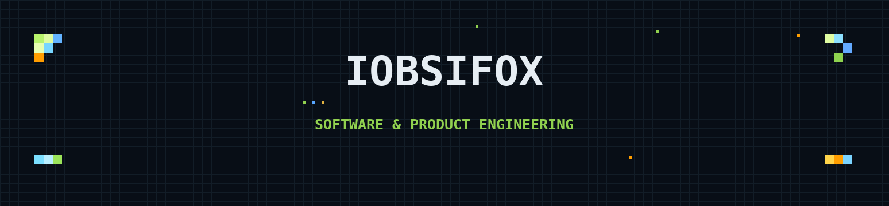

<div align="center">



# OBSIFOX

**Game & plugin developer** — Minecraft frameworks, launchers, tools & mobile fixes.

    

</div>

---

## Projects

<div align="center">

### [RPGMaker](https://github.com/iobsifox/RPGMaker)
**Complete game framework for Minecraft Paper 1.21+** — 84 systems: Combat, Quests, Bosses, Dungeons, Skills, Spells, Economy, Guilds, Parties, Crafting, and more. Java 21, fully tested.

  

### [SolidCraft](https://github.com/iobsifox/SolidCraft)
**Native dark-pixel Minecraft launcher** — C++20 / Qt 6, Modrinth & CurseForge discovery, SHA-256 verified self-update.

 

### [JoiPlay Touch Fix](https://github.com/iobsifox/Joiplay-Fix-Touch)
**Touch-input fix** for the JoiPlay emulator — touch-to-mouse sync, rapid-click prevention, lightweight plugin.


</div>

---

## Support

Building all of this in the open. If it helps you, consider a tip:

```
USDT (ERC-20): 0xfcdc026df89867aec34c3cfd3893b269924ce896
```

---

<div align="center">


<p></p>

</div>
